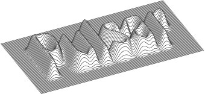
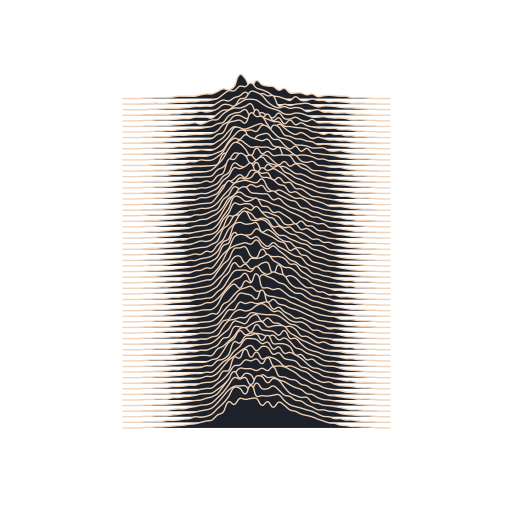
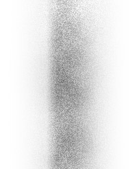

# 📡 Pulsar

Sketch Plugin that creates line rasters from bitmap layers. Inspired by the album cover of Joy Division's debut album Unknown Pleasures from 1979. 

The original artwork of the album is a visualisation of the radio signal emitted by CP 1919, the very first pulsar ever discovered, on 28 November 1967. The rendition was first created by Harold Craft for his PhD thesis. [Read more](https://qz.com/346826/joy-divisions-iconic-album-cover-is-actually-based-on-a-students-chart-from-the-1970s/)

*Reconstruction of the artwork using the plugin*

*The bitmap that was used to create the raster above*

## Usage

1. Select a bitmap layer
2. Run one of the two commands under the Pulsar menu.
3. Depending on the command the plugin will ask for the following parameters:
   1. **Density** The number of lines used to raster the image. The lines are spread over the height of the image. 
   1. **Depth** Defines how far the puts are elevated based on the brightness of the pixels in the image. In percentage of height of the image. 
   1. **View angle** *iso only* Rotation of the camera around the X axis. The higher the value, the more the camera will look down. 
   1. **Rotation** *iso only* Rotation of the camera around the Y axis. 

## Commands

| 📡 | Description |
| --- | --- |
| **Line raster straight...** | Rasterizes a bitmap layer with straight lines, similar to the original Joy Division album cover. |
| **Line raster isometric...** | Rasterizes a bitmpa layer with lines using an isometric projection. The plugin asks for the following inputs: **Density, Depth, View angle, Rotation**. |

## Installation

[Download](https://github.com/carlojoerges/pulsar/archive/master.zip) or
clone the latest version of this project, and open `Pulsar.sketchplugin`.

## Contact

* Email <carlo.joerges@gmail.com>
* Follow [@carlojoerges](https://twitter.com/carlojoerges) on Twitter

MIT License © Carlo Joerges.